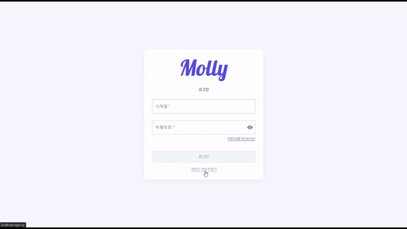
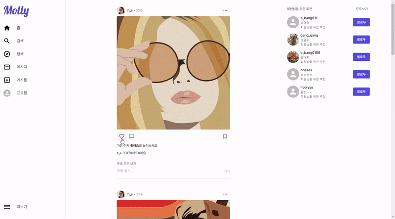

<h2>🔎 프로젝트 정보</h2>

<b>📆 2023.12.19 ~ 2024.03.22 (94일)</b>

 

웹 소셜 네트워크 서비스 Molly project의 Front-End Repository 입니다.
 

<b>배포 주소</b> : https://molly.n-e.kr/

 
<h2>🛠 Stacks</h2>

  
  
  
  
  

 
<h2>⚙ 핵심 기능</h2>
<h3>[회원가입 / 로그인]</h3>
<ul>
  <li>회원가입 시 이메일 인증기능을 구현하였습니다.</li>
  <li>회원가입, 로그인 성공 시 accessToken과 refreshToken을 받아 localstorage에 저장합니다</li>
</ul>

<h3>[팔로우 추천]</h3>
<ul>
  <li>회원가입 후 첫 로그인 시 메인페이지가 아닌 추천 팔로우 페이지로 이동</li>
  <li>랜덤으로 유저들을 팔로우 추천</li>
  <li>본인을 팔로우하고있는 유저들을 추천</li>
</ul>

<h3>[메인 페이지]</h3>
<ul>
  <li>본인과 팔로우 중인 유저의 게시물을 볼 수 있다</li>
  <li>게시물은 좋아요, 북마크 저장, 댓글작성 가능</li>
  <li>댓글 모두 보기 버튼을 통해 게시물 상세보기 가능</li>
</ul>

<h3>[게시물 생성]</h3>
<ul>
  <li>여러장의 이미지를 삽입할 수 있으며, 게시물의 내용과 태그를 작성할 수 있습니다</li>
  <li>이미지는 react-easy-crop를 이용하여 축소하거나 확대해 원하는 영역을 crop할 수 있습니다</li>
</ul>

<h3>[게시물 상세 보기]</h3>
<ul>
  <li>모달을 이용하여 게시물 내용에 집중할 수 있도록 하였습니다</li>
  <li>다른 유저들이 작성한 댓글을 볼 수 있고, 대댓글을 작성 할 수 있습니다</li>
  <li>작성한 댓글을 수정 또는 삭제 가능하며, 좋아요, 북마크 저장을 할 수 있습니다.</li>
</ul>

<h3>[게시물 수정/삭제]</h3>
<ul>
  <li>메인 페이지의 게시물 또는 상세보기 모달창을 통해 수정 또는 삭제할 수 있습니다</li>
</ul>

<h3>[검색]</h3>
<ul>
  <li>유저의 이름 또는 닉네임, 게시물의 태그를 검색 할 수 있습니다</li>
  <li>@는 유저 #은 게시물 태그를 검색하며, 아무것도 붙지않으면 전체 검색입니다</li>
  <li>검색 내역은 저장되어 편리한 이용 가능합니다</li>
</ul>

<h3>[탐색]</h3>
<ul>
  <li>본인과 팔로우중인 유저를 제외한 모든 유저의 게시물을 볼 수 있습니다</li>
  <li>게시물 미리보기 이미지를 클릭하면 상세 보기 가능</li>
</ul>

<h3>[메시지]</h3>
<ul>
  <li>유저들과 실시간 채팅 기능을 제공합니다</li>
  <li>WebSocket를 이용하여 실시간 채팅, 알림을 받을 수 있습니다</li>
</ul>

<h3>[프로필]</h3>
<ul>
  <li>유저가 작성한 게시물, 팔로워와 팔로우를 볼 수 있습니다.</li>
  <li>본인의 프로필의 경우 북마크로 저장한 게시물을 볼 수 있고 프로필을 수정할 수 있습니다</li>
</ul>

 
<h2>📺 시연 영상 </h2>

https://youtu.be/B1pdhy8Ys_0

